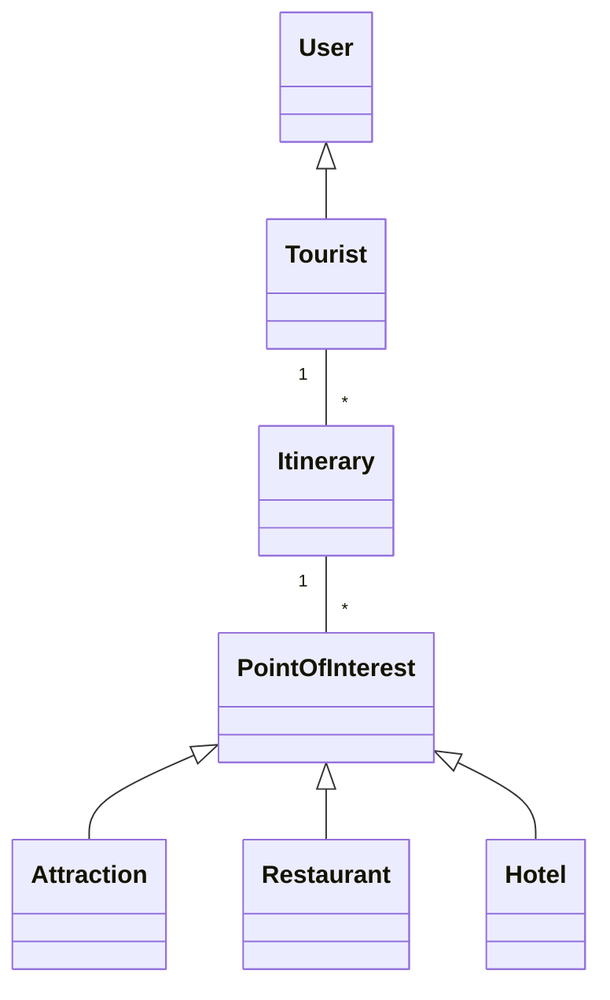

# Domain Model

## Description
- **User**: Represents the general user of the application.
- **Tourist**: A specific type of user who creates itineraries.
- **Itinerary**: A collection of points of interest tailored to the tourist's preferences.
- **PointOfInterest**: Represents a location of interest, which can be an attraction, restaurant, or hotel.